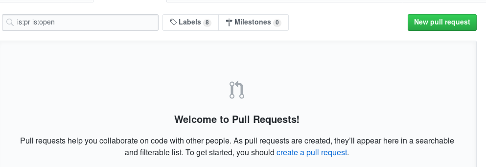
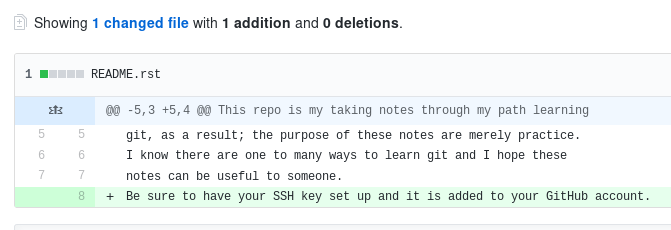
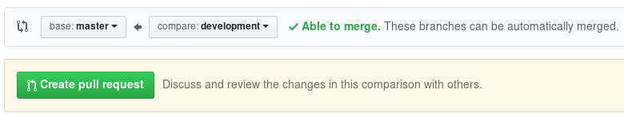
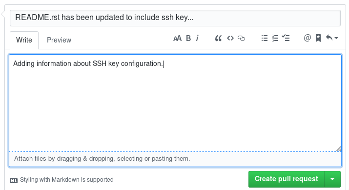
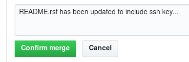

Pull Requests.
----------------------------------------------------------------------

Now, we will create the pull request for the commit we just push up to the remote repository.

- let's Login into our github account. For the purpose of this demo, It is easier to use the web
  interface for clicking on the pull request bottom. image-1

- Locate 'New pull request' and click it. image-2

- Inside 'Example comparisons box' click on the branch name we want to merge for seeing the
  additions that we made to the file. image-3

Note:The last line of the file is highlighted that means the new addition.

- Click on 'Create pull request bottom' image-4

- Add a comment in the comment box and click on the 'create pull request' bottom. image-5
  Github will be checking for any conflicts our branches may have and merge them neatly.
  If there are no conflicts then the messege displays 'This branch has no conflicts with the base
  branch'

- Click 'confirm merge' bottom. image-6

- Finally, if there are no conflicts then the following messege is displayed. image-7

.. image:: pull_request_done.png
   :width:: 800

- Let's go back to the <> Code tab section. In this section, we will see the README.rst file updated.

  * As long as we are contributor of the project, we will be able to create a pull request. if we are
    the maintainer or the owner of project then it will be the only way to make a merge.
